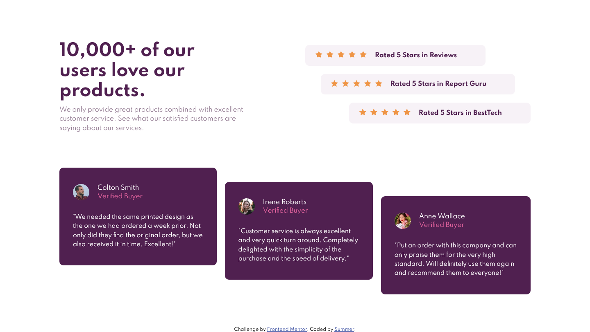

# Social proof section

This is a solution to the [Social proof section challenge on Frontend Mentor](https://www.frontendmentor.io/challenges/social-proof-section-6e0qTv_bA). 
## Table of contents

- [Social proof section](#social-proof-section)
  - [Table of contents](#table-of-contents)
  - [Overview](#overview)
    - [The challenge](#the-challenge)
    - [Links](#links)
    - [Screenshot](#screenshot)
    - [Built with](#built-with)

## Overview

### The challenge

Users should be able to:

- View the optimal layout for the section depending on their device's screen size

### Links

- Solution URL: [GitHub](https://github.com/summermmg/Social-proof-section)
- Live Site URL: [Demo](https://summermmg.github.io/Social-proof-section/)

### Screenshot

### Built with

- Semantic HTML5 markup
- CSS custom properties
- Flexbox
- CSS selector
- Mobile-first workflow
